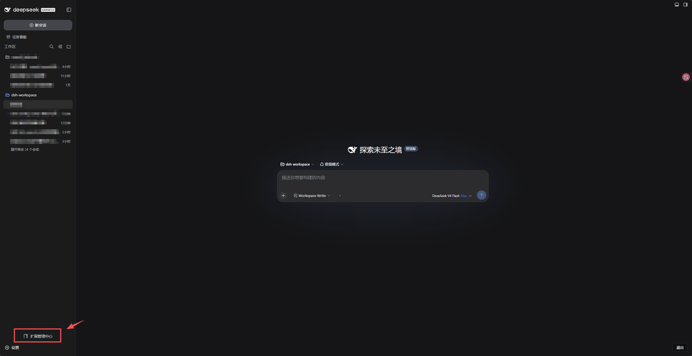
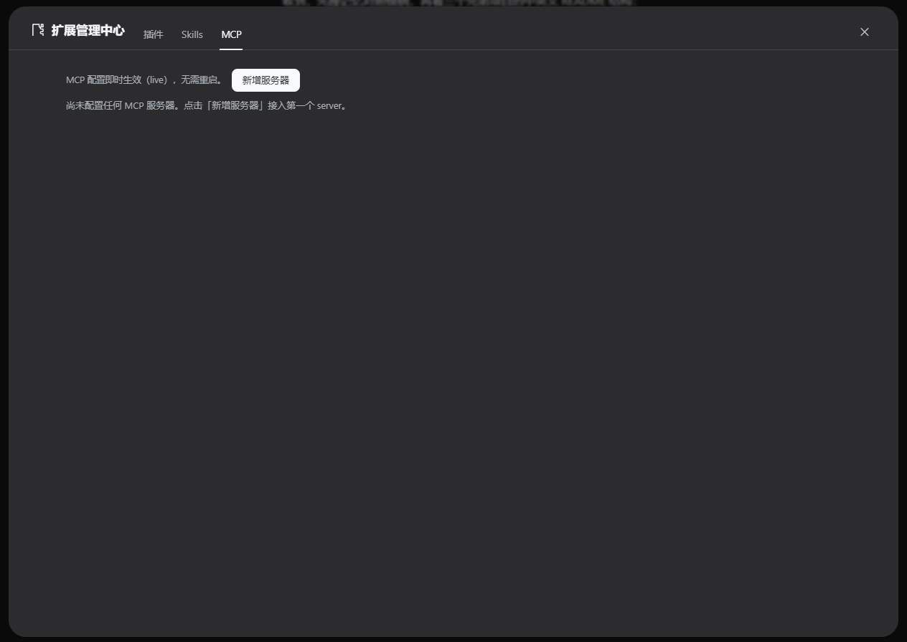

# dsh-config-center — Extension Center

> A zero-intrusion bundle for DeepSeek Harness: manage **plugins / skills / MCP servers** from the WebUI — add, edit, toggle and remove without touching the CLI or config files. No changes to dsh source code.

[](LICENSE)
[](package.json)
[](package.json)

**English** | [简体中文](README.zh-CN.md)

## Features

One entry point — **Extension Center** reachable from the left sidebar footer (next to **Settings**, same official slot as the Cordis panel). Click it to open a full-screen management page with three tabs:

| Tab | What you can do | When it takes effect |
|---|---|---|
| **Plugins** | Install / remove **bundle plugins** (same spec as `dsh plugin --profile web add`, supports `name@version`, local path, `github:owner/repo`) **and** edit the logical rows of `cordis.patch.yml` (add / edit name + config JSON / disable / remove); source annotation (direct / insert block / group child); contentHash concurrency fence | After writing to disk + restarting the profile |
| **Skills** | Aggregated multi-root scan (ranks 100–500); model-visible / user-invocable frontmatter toggles; delete (realpath escape protection); **full SKILL.md edit & save** (hash fence, read-only roots shown read-only) | Hot-applied by the watcher after save |
| **MCP** | Add / edit (stdio + streamable-http) / disable / remove servers; live connection badge (connected / tool count); one-click probe (60s timeout) | Live via settings, immediate |

## Requirements

- DeepSeek Harness `dsh` (`web` profile), Node.js `>= 22`
- The browser bundle ships prebuilt in `lib/`, so a clone installs as-is

## Install / Uninstall

```bash
# 1) Get the plugin (lib/ is committed — clone & install, no build needed)
git clone https://github.com/runfali/dsh-config-center.git
cd dsh-config-center

# 2) Install (standard bundle plugin; dependencies resolve into the profile node_modules)
dsh plugin --profile web add .

# 3) Restart dsh to activate (systemctl restart dsh, or restart the process your way)

# Uninstall
dsh plugin --profile web remove dsh-config-center
```

> After modifying the source, rebuild with `npm install && npm run build` (esbuild output in `lib/` is committed so clones work out of the box).

## Screenshots

| Entry point (left sidebar footer, next to Settings) | MCP tab |
|---|---|
|  |  |

## Configuration

Config can be overridden by appending a full-replacement block to `~/.dsh/profiles/web/cordis.patch.yml`:

```yaml
- id: config-center
  config:
    patchPath: ""          # absolute path to cordis.patch.yml; empty = auto-locate (derivable in bundle install state)
    skillsRoot: ""         # override the writable skills root (default ~/.dsh/skills)
    maxPatchBytes: 1048576 # read cap for the patch file
    projectRoot: ""        # scan start point for project skills; empty = skip project roots
    customSkillDirs: []    # extra custom skill roots (read-only display)
```

## Verification (after install + restart)

```bash
# 1) Bundle mounted: package name present in the __DSH_BOOT__ manifest
curl -s http://127.0.0.1:3080/ | grep -o 'dsh-config-center' | head -1

# 2) Client bundle servable (HTTP 200)
curl -s -o /dev/null -w '%{http_code}\n' http://127.0.0.1:3080/plugins/dsh-config-center/client.js

# 3) RPC channel alive
curl -s http://127.0.0.1:3080/api/config-center/ping
# → {"ok":true,"name":"dsh-config-center","version":"0.1.0",...}

# 4) Patch rows readable (seed rows + flat view)
curl -s http://127.0.0.1:3080/api/config-center/listRows | head -c 400
```

UI smoke test (browser → left sidebar footer → **Extension Center**):

1. **Plugins tab**: add a row `id: demo-plugin, name: <any absolute path or package name>` → row appears → yellow restart banner shows → still present after restart → delete it. Or install a bundle by spec (`dsh-better-sidebar@0.15.0`), remove it again.
2. **Skills tab**: existing skills are listed → toggle "model-visible" on a user-root skill → takes effect within seconds (no restart) → click **Edit** to change SKILL.md content → save → file updated on disk and hot-applied.
3. **MCP tab**: add a stdio server (e.g. `command: npx, args: -y @modelcontextprotocol/server-everything`) → badge flips to "connected · N tools" → probe returns the tool list → disable → badge "disabled" and tools go offline → delete.
4. **Secret regression**: edit an MCP entry containing `env`, save without entering a value → value in `~/.dsh/settings.yaml` unchanged (empty = keep).

## Security design

- **Same-origin fence** — all RPC endpoints enforce paperclip-style loopback / origin / `sec-fetch-site` checks; cross-site requests get 403.
- **Secrets never travel the wire** — `env` / `headers` are marked `role('secret')`, the wire side (`settings.describe` redaction) never returns real values; the UI shows a "configured" badge only; all writes go through incremental pathOps (`mcpMutate`), **empty = keep existing value**.
- **Concurrency fence** — patch writes carry `contentHash`; stale requests against a file changed externally are rejected with 409.
- **Dynamic expression protection** — patch content containing `!!js` / `process.env.*` is refused for UI writes (load → dump would break evaluation semantics); edit by hand instead.
- **Path-escape protection** — skill deletion / writes realpath-check strictly inside the writable root.
- **Atomic writes** — patch and SKILL.md both land via tmp + rename, `.bak` kept, mode 0600.

## Architecture at a glance

```
src/index.js          Host half: route registration (webServer.register) + settings namespace + supervisor wiring
src/mcp-schema.js     mcp-center schema (flat modeling — secrets inside union branches are unreachable for the redact walker)
src/mcp-supervisor.js isolate('mcp') dynamic mount of dsh-mcp-client + diff rebuild + testMcp + tool counting
src/patch-editor.js   structure-aware patch editing (insert directives / group nesting / !!js guard / hash fence / atomic write)
src/skills-editor.js  multi-root scan + frontmatter toggles + escape protection
src/bundle-manager.js bundle install / remove (queued pnpm execution + profile package.json reconciliation)
src/client.tsx        browser half: sidebar.footer.action entry + shell.overlay full-screen page + tab shell
src/client/*          the three tabs + shared UI primitives + rpc wrapper
build.mjs             esbuild CJS factory envelope (same shape as official bundles)
tests/*.mjs           node --test unit + real-HTTP integration tests (46 cases)
```

Design document: [DESIGN.md](DESIGN.md) (v2, with a progress table at the top) · audit report: [AUDIT.md](AUDIT.md).

## Rollback

```bash
# Version rollback (one commit per task)
git log --oneline                 # find the target commit
git revert <commit>               # or git checkout <commit> -- .

# Runtime rollback: remove the plugin + restart
dsh plugin --profile web remove dsh-config-center

# Patch file emergency (a .bak is kept before every UI write)
cp ~/.dsh/profiles/web/cordis.patch.yml.bak ~/.dsh/profiles/web/cordis.patch.yml

# Take all MCP servers offline: empty the mcp-center section of settings.yaml
```

## Known limitations

- Plugin changes require a profile restart (the Cordis composition is assembled at startup; no hot reload). Skills / MCP are immediate.
- Bundles marked **InBox** (built-in) are shown read-only; everything else can be installed / removed from the UI.
- MCP bridges Tools only (Resources / Prompts are an upstream boundary of `dsh-mcp-client`).
- No UI for creating new skills from scratch (subdirectories / scripts are complex; create on disk and click **Refresh**); zip upload / git clone import not implemented.
- UI copy is currently Chinese-only.

## License

[MIT](LICENSE)