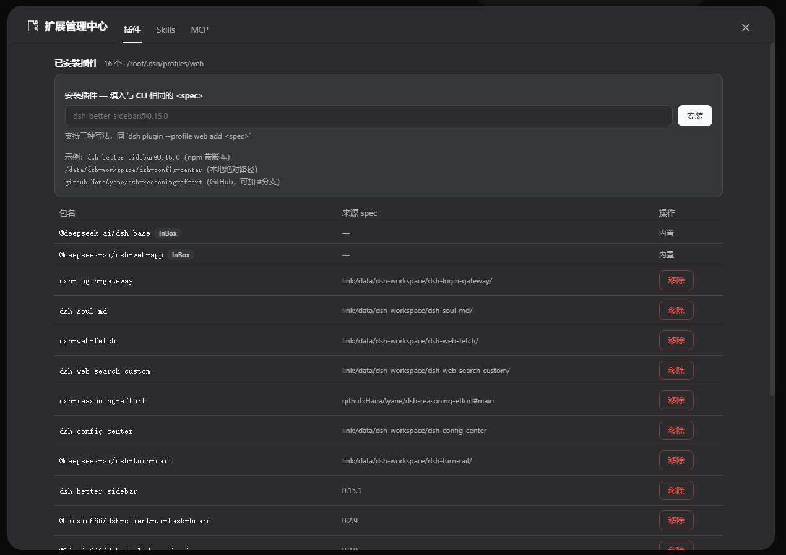
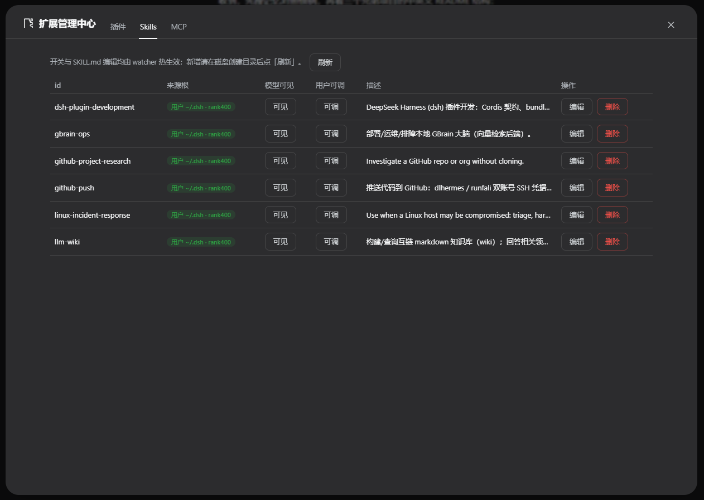

# dsh-config-center — 扩展中心

[](LICENSE)
[](package.json)
[](package.json)

> DeepSeek Harness 零侵入 bundle 插件：在 WebUI 中统一管理 **插件 / Skill / MCP** 的增删改查 —— 不碰命令行、不修改 dsh 源码。

[English](README.md) | **简体中文**

主界面左侧栏底部的「扩展管理中心」直达（Settings 旁，与 Cordis 面板同款官方挂点），点击打开**全屏管理页**，内部三 Tabs：

| Tab | 能力 | 生效方式 |
|---|---|---|
| **插件** | **bundle 安装 / 移除**（spec 与 `dsh plugin --profile web add` 一致，支持 `name@version` / 本地路径 / `github:owner/repo` 三种写法）**+** cordis.patch.yml 逻辑行的新增 / 编辑（name+config JSON）/ 禁用启用 / 删除；来源标注（直挂/insert块/group子行）；contentHash 并发围栏 | 写盘后提示重启 Profile |
| **Skills** | 多根聚合扫描（rank 100-500）；模型可见/用户可调 frontmatter 开关；删除（realpath 越界防护）；**SKILL.md 全文编辑-保存**（hash 围栏、只读根只读展示） | 编辑保存后 watcher 热生效 |
| **MCP** | server 新增 / 编辑（stdio+streamable-http）/ 停用启用 / 删除；连接状态徽标（connected/tools 数）；一键探活（60s 超时） | settings live 即时生效 |

## 安装 / 卸载

```bash
# 1) 获取插件（仓库已含构建产物 lib/，clone 即装即用）
git clone https://github.com/runfali/dsh-config-center.git
cd dsh-config-center

# 2) 安装（标准 bundle 插件；自动解析依赖到 profile node_modules）
dsh plugin --profile web add .

# 3) 重启 dsh 生效
# （按你现有的重启方式：systemctl restart dsh 或手动重启进程）

# 卸载
dsh plugin --profile web remove dsh-config-center
```

> 改动源码后需 `npm install && npm run build` 重新生成 `lib/`（esbuild 产物随仓库提交，便于 clone 即用）。

### 截图

| 入口（左侧栏底部，Settings 旁） | 插件 Tab |
|---|---|
|  |  |
| **Skills Tab** | **MCP Tab** |
|  |  |

## 可选配置覆盖

在 `~/.dsh/profiles/web/cordis.patch.yml` 追加（整段替换 config）：

```yaml
- id: config-center
  config:
    patchPath: ""          # cordis.patch.yml 绝对路径；空=自动定位（bundle安装态可反推）
    skillsRoot: ""         # 覆盖默认可写技能根 ~/.dsh/skills
    maxPatchBytes: 1048576 # patch 文件读取上限
    projectRoot: ""        # 项目技能根扫描起点；空=跳过 project 根
    customSkillDirs: []    # 额外自定义技能根（只读展示）
```

## 验证清单（安装重启后执行）

```bash
# 1) bundle 已挂载：__DSH_BOOT__ 清单含包名
curl -s http://127.0.0.1:3080/ | grep -o 'dsh-config-center' | head -1

# 2) client bundle 可服务（HTTP 200）
curl -s -o /dev/null -w '%{http_code}\n' http://127.0.0.1:3080/plugins/dsh-config-center/client.js

# 3) RPC 通道存活
curl -s http://127.0.0.1:3080/api/config-center/ping
# → {"ok":true,"name":"dsh-config-center","version":"0.1.0",...}

# 4) 插件行读取（应列出 seed 行与 flat 视图）
curl -s http://127.0.0.1:3080/api/config-center/listRows | head -c 400
```

UI 冒烟（浏览器 → 左侧栏底部「扩展管理中心」→ 打开全屏页）：

1. **插件 Tab**：新增 `id: demo-plugin, name: <任意绝对路径或包名>` → 列表出现 → 黄条提示重启 → 重启后仍存在 → 删除。或按 spec 安装 bundle（如 `dsh-better-sidebar@0.15.0`）后移除。
2. **Skills Tab**：列表出现现有技能 → 对 user 根技能切换「模型可见」→ 数秒内生效（无需重启）→ 点「编辑」改 SKILL.md 内容 → 保存 → 磁盘文件已更新且热生效。
3. **MCP Tab**：新增 stdio server（如 `command: npx, args: -y @modelcontextprotocol/server-everything`）→ 保存后徽标变「已连接 · N 工具」→ 探活返回工具清单 → 停用 → 徽标「已停用」且工具下线 → 删除。
4. **secret 回归**：编辑含 env 的 MCP 条目，不填值直接保存 → `~/.dsh/settings.yaml` 中原值不变（留空=保持）。

## 安全设计

- **同源围栏**：所有 RPC 经 paperclip 式 loopback/origin/sec-fetch-site 校验，跨站 403。
- **Secret 不走线**：env/headers 标 `role('secret')`，wire 面（settings.describe redact）永不回传实值；UI 密码框只显示「已配置」徽标；写路径全部为 pathOp 增量改（`mcpMutate`），**留空=保持存量值**。
- **并发围栏**：patch 写操作携带 contentHash，文件被外部修改后旧请求拒绝 409。
- **动态表达式保护**：含 `!!js` / `process.env.*` 的 patch 内容拒绝 UI 写入（load→dump 会破坏求值语义），引导手工编辑。
- **路径逃逸防护**：skill 删除/写入前 realpath 校验必须严格位于可写根内。
- **原子写**：patch 与 SKILL.md 均 tmp+rename 落盘，保留 `.bak`，权限 0600。

## 架构速览

```
src/index.js          Host 半：路由注册(webServer.register) + settings namespace + supervisor 接线
src/mcp-schema.js     mcp-center schema（扁平建模——union 内 secret 对 redact walker 不可达）
src/mcp-supervisor.js isolate('mcp') 动态挂载 dsh-mcp-client + diff rebuild + testMcp + 工具计数
src/patch-editor.js   结构感知 patch 编辑（insert指令/group嵌套/!!js拦截/hash围栏/原子写）
src/skills-editor.js  多根扫描 + frontmatter 开关 + 越界防护
src/bundle-manager.js bundle 安装/移除（pnpm 队列化执行 + profile package.json 同步）
src/client.tsx        浏览器半入口：sidebar.footer.action 入口注册 + shell.overlay 全屏管理页 + Tabs 壳
src/client/*          三 Tab 实现 + 共享 UI 原语 + rpc 封装
build.mjs             esbuild CJS factory envelope 构建（同官方 bundle 形态）
tests/*.mjs           node --test 单元 + 真 HTTP 集成测试（46 用例）
```

设计文档见 [DESIGN.md](DESIGN.md)（v2 含头部进度总表）、审计报告见 [AUDIT.md](AUDIT.md)。

## 回滚

```bash
# 版本回滚（git 逐任务提交）
git log --oneline                 # 找到目标 T<n> 提交
git revert <commit>               # 或 git checkout <commit> -- .

# 运行态回滚：卸载插件 + 重启
dsh plugin --profile web remove dsh-config-center

# patch 文件损坏应急（每次 UI 写入前都会留 .bak）
cp ~/.dsh/profiles/web/cordis.patch.yml.bak ~/.dsh/profiles/web/cordis.patch.yml

# MCP 全量下线：清空 settings.yaml 中 mcp-center 段即可
```

## 已知限制

- 插件改动需重启 Profile（cordis 组合在启动时装载，无热重载）；Skill/MCP 即时生效。
- **InBox（内置）** bundle 只读展示，其余 bundle 可在 UI 安装/移除。
- MCP 仅桥接 Tools（Resources/Prompts 为上游 dsh-mcp-client 的既定边界）。
- Skill 不提供 UI 新增（子目录/脚本结构复杂，请在磁盘创建后点「刷新」）；上传 zip / git clone 导入未实现。
- UI 文案当前为中文单语。

## License

[MIT](LICENSE)